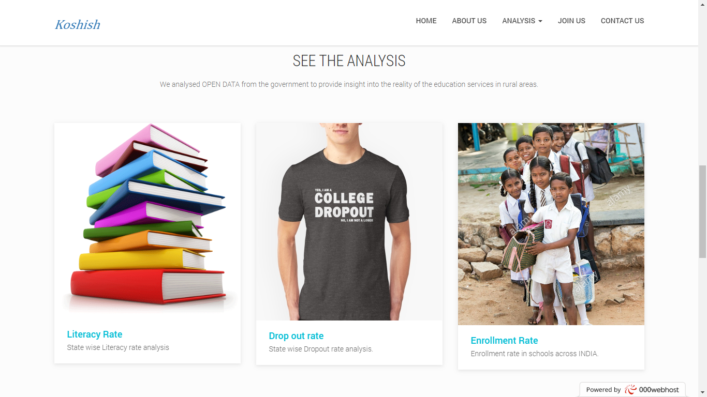
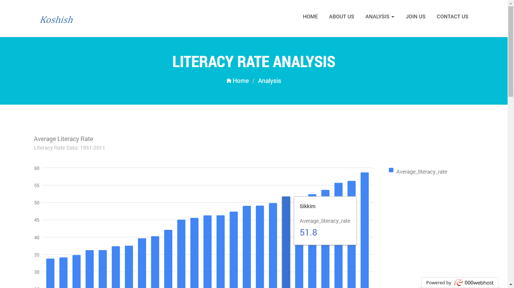
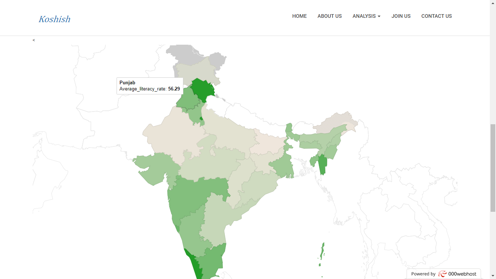
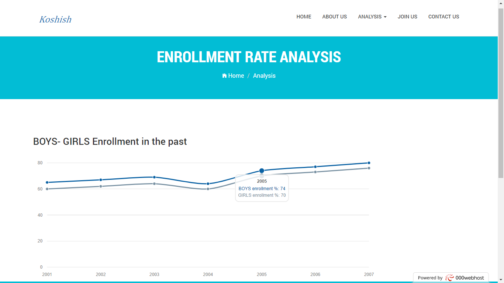
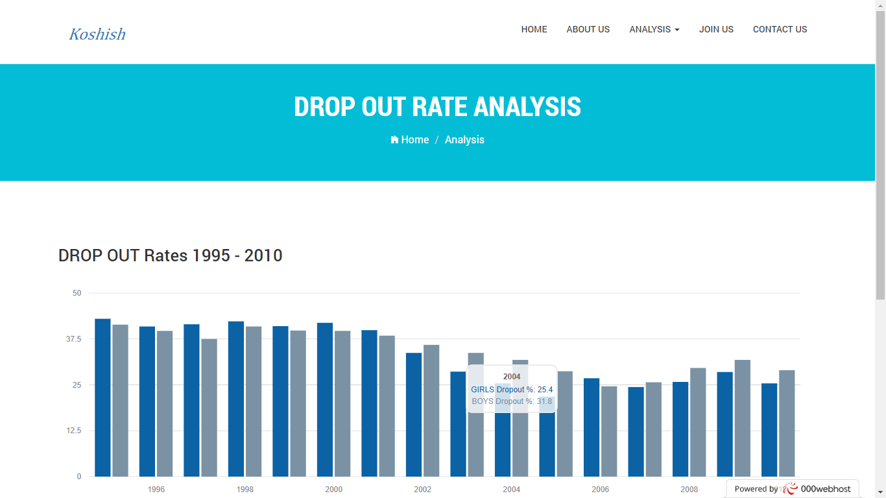
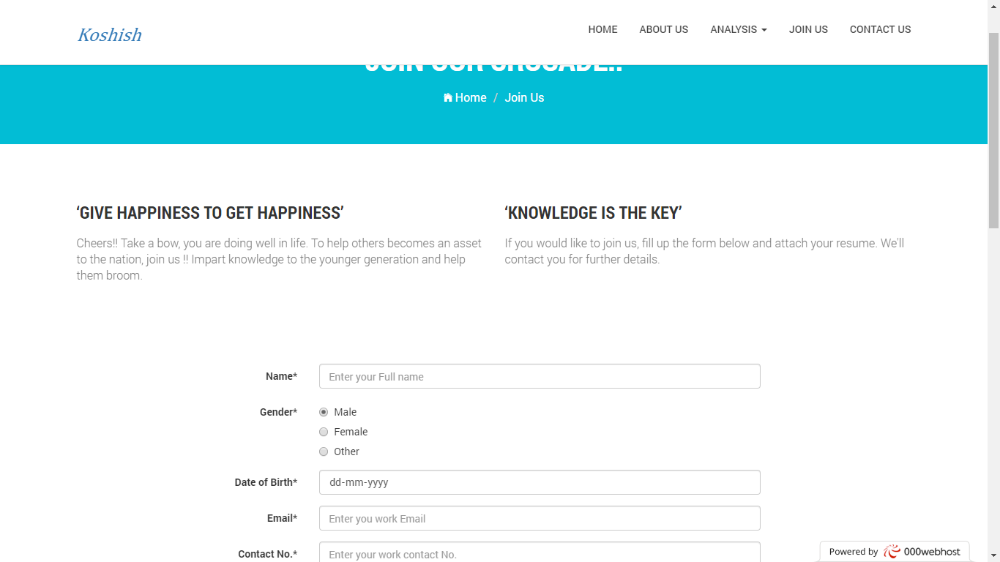
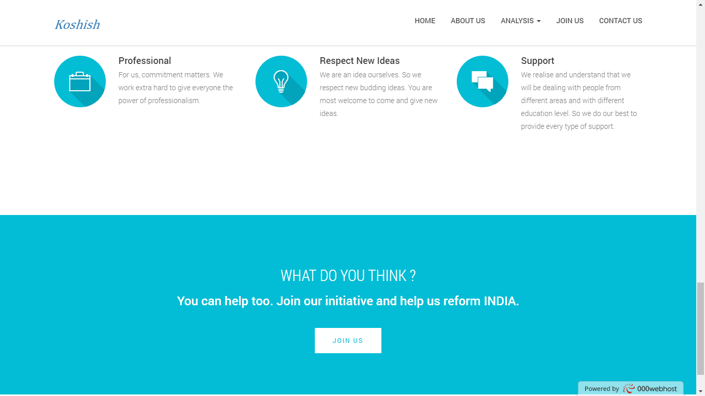
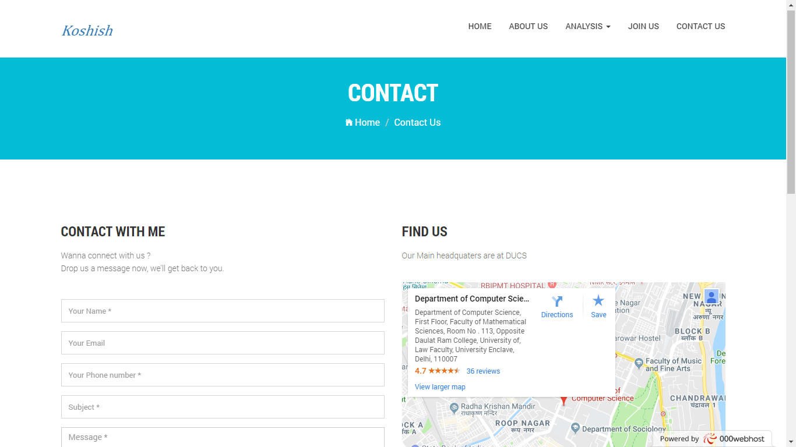

# Koshish Website - open data gov hack 2017

Source code for the project koshish made in open data gov hack 2017

## Dev

- `DEMO` - See the demo at [https://koshishodgh.000webhostapp.com/](https://koshishodgh.000webhostapp.com/)
- `Trivia`- Website was made in 24 hours on 8th Oct 2017
- `Requirements` - To serve properly, you need `php` and `mysql` installed
- First, Import the database dump `id3182218_koshish.sql` into your mysql server
- Change database credentials in `Qconnect.php`
- go to `src` directory and fire up the server `php -S localhost:3000`
- Alternatively, you can serve with `xampp`

## Screenshots

